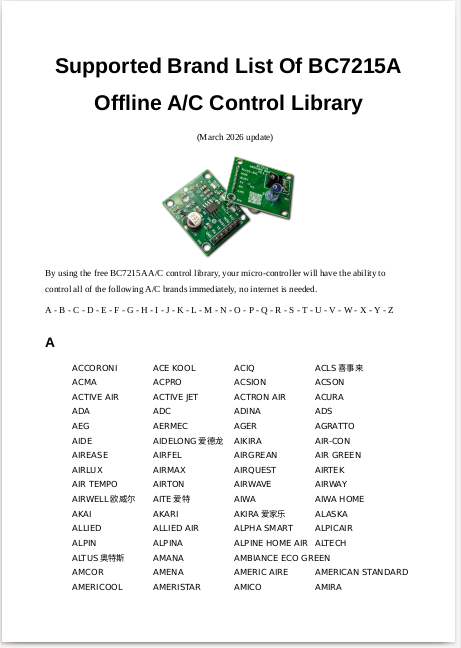
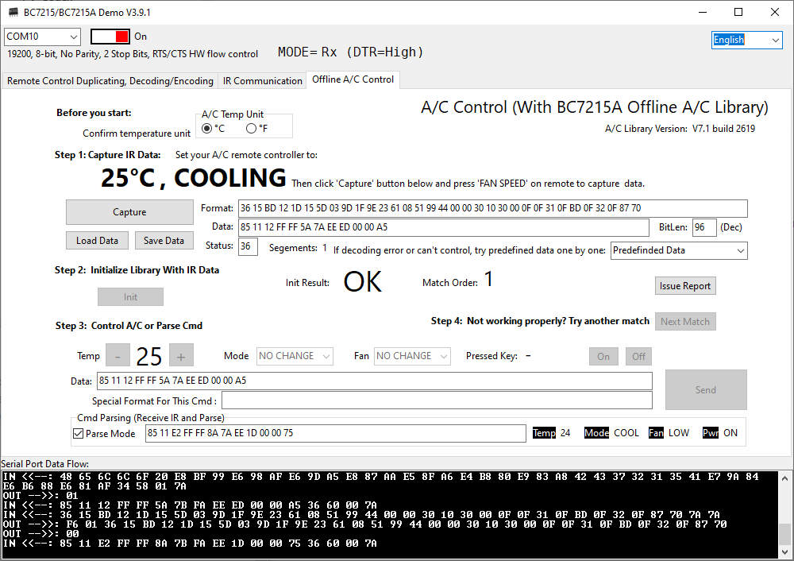

# BC7215A Offline Air Conditioner Control Library

This library is a combined package containing the low-level driver library for the BC7215(A) chip and the BC7215A offline air conditioner control library, referred to below as the AC library. When used together with the AC library, the BC7215A chip enables ordinary microcontrollers to provide universal air conditioner control capabilities. It can control almost all air conditioner brands and models. In addition to control functions, it also provides air conditioner IR remote signal decoding, allowing temperature, mode, fan speed, and power status information to be extracted from IR signals.

An Arduino version of this library is also available: [https://github.com/bitcode-tech/bc7215ac](https://github.com/bitcode-tech/bc7215ac)



[Complete List of Supported Brands](./docs/supported_ac_brand_list_en.pdf)

The AC library is provided as C source code(obfuscated). In theory, it can be used on any system that supports the C language, including microcontrollers, embedded systems, Windows, Linux, and more. The library is compact; on a Cortex-M3 system, it requires only about 50 KB of space after compilation.

An official Windows demo application is provided. After connecting the development board or the user's own circuit, the software can demonstrate not only the basic IR transmitting and receiving functions of the BC7215(A) chip, but also the complete air conditioner control functionality.



In addition to the demo software, several microcontroller examples are provided, including basic IR encoding and decoding, IR communication, and air conditioner control. The selected processors include STM32 and C51. The STM32 examples include complete **STM32 CubeIDE** project files, which can be imported directly into CubeIDE after downloading.

The **ESP-IDF(ESP32)** example  uses the FreeRTOS and C++ which is the standard ESP-IDF setup. If you want to port it to other similar environments, you can refer to this example.

The **Linux** edition is written in C++ with makefile as a complete project, can be compiled and run in both desktop and embedded environments.

Directory structure:

```text
root/
├─ bc7215_ac_lib/                       <- Library source files
├─ docs/
│  ├─ img/
│  ├─ bc7215_en.pdf                     <- BC7215(A) chip datasheet
│  ├─ bc7215_lib_manual_en.pdf          <- Low-level driver library manual
│  ├─ bc7215a_ac_lib_manual_en.pdf      <- BC7215A AC library manual
│  ├─ bc7215ev_manual_en.pdf            <- Dev board and software manual
│  ├─ programming_flowchart.pdf         <- AC library prog flowchart
│  ├─ ac_lib_demo_code(pseudo)-en.pdf   <- AC library pseudocode
│  ├─ bc7215_lib_examples_en.pdf        <- Low-level example documentation
│  ├─ stm32_ac_demo_manual_en.pdf       <- STM32 AC control example documentation
│  ├─ ESP-IDF_example_doc_en.pdf        <- ESP32 AC control example documentation
│  ├─ linux_example_doc_en.pdf          <- Linux AC control example documentation
│  ├─ trouble_shooting_en.pdf           <- BC7215(A) chip troubleshooting
│  ├─ release_notes.txt                 <- AC library release notes
│  ├─ supported_ac_brand_list_en.pdf    <- List of supported AC brands
│  └─ ac_lib_issue_feedback.pdf         <- AC library issue feedback form
├─ examples/
│  ├─ C51/                              <- Low-level examples for C51
│  │  ├─ ir_switch/                     <- IR controlled switch example
│  │  ├─ comm/                          <- IR data communication example
│  │  └─ prog_remote/                   <- Learning remote control example
│  ├─ STM32_REG/                        <- STM32 using direct register r/w
│  │  ├─ ir_switch/
│  │  ├─ comm/
│  │  └─ prog_remote/
│  ├─ ESP-IDF/                          <- AC Control example ESP-IDF version (C++/FreeRTOS)
│  ├─ STM32_CubeIDE/                    <- STM32 CubeIDE version
│  │  ├─ ir_switch/
│  │  ├─ comm/
│  │  ├─ prog_remote/
│  │  └─ BC7215AC/                      <- AC control example STM32 version
│  └─ Linux/                            <- AC control example Linux version (Desktop/Embedded)
├─ util/                                <- Windows demo application
├─ README.md
└─ LICENSE
```

Documents for developers:

[BC7215(A) chip datasheet](./docs/bc7215_en.pdf)

[BC7215(A) low-level driver library manual](./docs/bc7215_lib_manual_en.pdf)

[BC7215A AC control library manual](./docs/bc7215a_ac_lib_manual_en.pdf)

[Development board and demo software manual](./docs/bc7215ev_manual_en.pdf)

[AC library programming flowchart](./docs/programming_flowchart.pdf)

[AC library example pseudocode](./docs/ac_lib_demo_code(pseudo)-en.pdf)

[BC7215(A) Low-level driver example documentation](./docs/bc7215_lib_examples_en.pdf)

[STM32 AC control example manual](./docs/stm32_ac_demo_manual_en.pdf)

[ESP-IDF(ESP32) AC Control example documentation](./docs/ESP-IDF_example_doc_en.pdf)

[Linux AC control example documentation](./docs/linux_example_doc_en.pdf)

[BC7215(A) chip troubleshooting](./docs/trouble_shooting_en.pdf)

[AC control library issue feedback form](./docs/ac_lib_issue_feedback.pdf)
